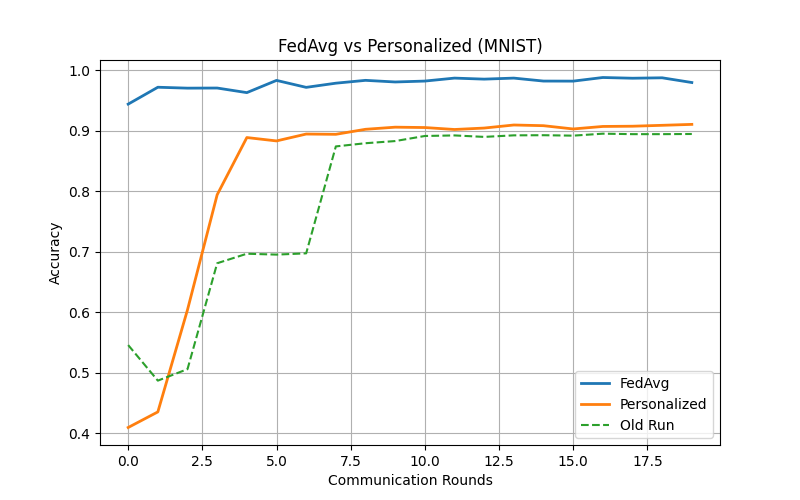
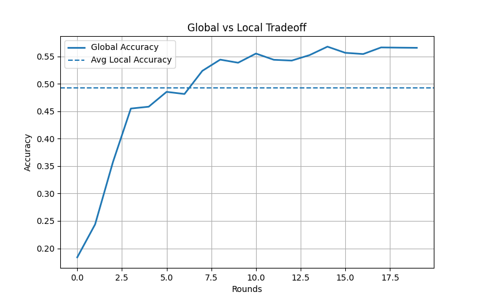
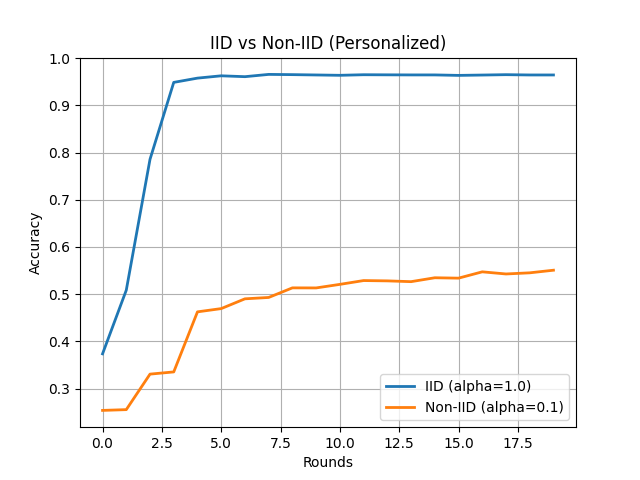

# Privacy-Preserving Federated Personalized Learning using Flower and PyTorch

## Overview

This project presents a complete implementation and experimental analysis of **Privacy-Preserving Federated Personalized Learning (PPMLFPL)** using the **Flower Federated Learning Framework** and **PyTorch**.

The implementation is inspired by the IEEE research paper:

> **Privacy Preserving Machine Learning Model Personalization through Federated Personalized Learning**  
> ICDABI 2023 IEEE Conference

The project reproduces and extends the concepts discussed in the paper using:

- Federated Learning (FL)
- Personalized Federated Learning (PFL)
- Non-IID client data distributions
- FedAvg baseline
- FedProx optimization
- Client-wise personalization analysis
- Global vs Personalized model tradeoff evaluation

Unlike centralized machine learning systems, federated learning enables multiple clients to collaboratively train a shared model without exchanging raw data, thereby preserving privacy while still enabling distributed model training.

This project further explores:
- Personalization in federated learning
- Client heterogeneity
- Stability under non-IID settings
- Tradeoffs between global and local adaptation

---

# Features

- Federated Learning using Flower (`flwr`)
- Deep Learning with PyTorch
- CIFAR-10 and MNIST support
- Non-IID data partitioning using Dirichlet distribution
- Personalized Federated Learning
- FedAvg implementation
- FedProx implementation
- Per-client personalized evaluation
- Global vs Personalized accuracy analysis
- Statistical variance analysis across clients
- Automatic metric aggregation
- Automatic result visualization
- Modular and extensible architecture

---

# Research Motivation

Modern AI systems rely heavily on user-generated data. However, centralized machine learning introduces several privacy concerns:

- Data leakage
- Unauthorized access
- User confidentiality risks
- Centralized data storage vulnerabilities

Federated Learning addresses these concerns by:
- Keeping data localized on client devices
- Sharing only model updates
- Enabling collaborative learning without raw data exchange

This project investigates:
- How personalization affects federated learning performance
- How heterogeneous client data impacts convergence
- The tradeoff between global generalization and local adaptation
- The behavior of FedProx under non-IID settings

---

# Objectives

The primary objectives of this project are:

1. Reproduce the federated learning workflow described in the research paper
2. Implement personalized federated learning
3. Extend the baseline using FedProx
4. Analyze non-IID data effects
5. Evaluate global and personalized performance
6. Visualize convergence and heterogeneity trends

---

# Technologies Used

| Technology | Purpose |
|------------|---------|
| Python | Core programming language |
| PyTorch | Deep learning framework |
| Flower (flwr) | Federated learning framework |
| NumPy | Numerical computation |
| Matplotlib | Visualization |
| CIFAR-10 | Image classification dataset |
| MNIST | Handwritten digit dataset |

---

# Project Structure

```plaintext
fl_project/
│
├── src/
│   ├── client.py
│   ├── server.py
│   ├── model.py
│   ├── data.py
│   ├── utils.py
│   └── __init__.py
│
├── configs/
│   └── config.py
│
├── results/
│   ├── comparison.png
│   ├── global_vs_local.png
│   ├── iid_vs_noniid.png
│   └── additional experiment plots
│
├── run_s.py
├── run_c.py
├── plot.py
├── results.json
└── README.md
```

---

# Federated Learning Workflow

## Step 1: Data Partitioning

The dataset is partitioned across multiple clients using a **Dirichlet distribution** to simulate realistic non-IID federated environments.

Lower alpha values create stronger heterogeneity among clients.

---

## Step 2: Local Training

Each client:
- Receives global model parameters
- Trains locally using private data
- Sends updated parameters back to the server

---

## Step 3: Federated Aggregation

The server aggregates client updates using:

### FedAvg
Standard weighted averaging of client models.

### FedProx
FedProx extends FedAvg by adding a proximal regularization term that reduces excessive client drift under heterogeneous data distributions.

---

## Step 4: Personalization

After receiving the global model, clients further fine-tune locally to obtain personalized models.

This enables evaluation of:
- Global model performance
- Personalized client performance

---

# Model Architecture

A lightweight Convolutional Neural Network (CNN) is used for classification.

Architecture includes:
- Convolutional layers
- Max pooling layers
- Fully connected layers
- ReLU activations

The architecture is intentionally lightweight to support efficient federated experimentation across multiple clients.

---

# FedProx Extension

FedProx improves federated optimization stability under non-IID settings by adding a proximal regularization term:

\[
L = L_{CE} + \frac{\mu}{2} ||w - w_g||^2
\]

Where:
- \(L_{CE}\) = cross-entropy loss
- \(w\) = local client parameters
- \(w_g\) = global model parameters
- \(\mu\) = proximal coefficient

This helps reduce client drift while improving convergence stability.

---

# Evaluation Metrics

The following metrics are evaluated during training:

## Global Accuracy
Performance of the shared global model.

## Personalized Accuracy
Performance after local client fine-tuning.

## Personalized Standard Deviation
Variance across client accuracies.

## Personalization Gap
Difference between personalized and global performance.

---

# Experimental Settings

| Parameter | Value |
|-----------|------|
| Optimizer | SGD |
| Learning Rate | 0.01 |
| Local Epochs | 5 |
| Personalization Epochs | 3 |
| Batch Size | 32 |
| Communication Rounds | 20 |
| Fraction Fit | 0.5 |
| Dirichlet Alpha | 0.1 / 0.5 / 1.0 |

---

# Experiments Performed

The following experiments were conducted:

- FedAvg vs Personalized Federated Learning
- Global vs Local Tradeoff Analysis
- IID vs Non-IID Comparison
- FedProx-based stabilization
- Client heterogeneity analysis
- Personalized accuracy evaluation

---

# Results and Visualizations

## 1. FedAvg vs Personalized Learning (MNIST)

This experiment compares standard FedAvg with personalized federated learning on MNIST.

### Observations
- FedAvg achieves very high convergence rapidly.
- Personalized models initially improve slower but stabilize over time.
- Personalized learning performs significantly better than earlier baseline runs.

### Final Results
| Method | Final Accuracy |
|--------|----------------|
| FedAvg | ~98% |
| Personalized | ~91% |
| Old Baseline Run | ~89% |



---

## 2. Global vs Local Tradeoff

This experiment studies the tradeoff between:
- Global model generalization
- Average local client adaptation

### Observations
- Global accuracy steadily improves over rounds.
- Local client adaptation stabilizes earlier.
- FedProx improves convergence stability.

### Final Results
| Metric | Final Accuracy |
|--------|----------------|
| Global Accuracy | ~56% |
| Average Local Accuracy | ~49% |



---

## 3. IID vs Non-IID Comparison

This experiment compares personalized learning under:
- IID client distributions
- Strongly Non-IID client distributions

### Observations
- IID settings converge significantly faster.
- Non-IID distributions reduce convergence speed.
- Personalization becomes more important under stronger heterogeneity.

### Final Results
| Setting | Final Accuracy |
|---------|----------------|
| IID (alpha=1.0) | ~96% |
| Non-IID (alpha=0.1) | ~55% |



---

# Key Insights

- Personalization benefits increase under stronger non-IID conditions.
- FedProx improves convergence stability.
- Global models generalize better over time.
- Personalized models adapt faster in early rounds.
- Statistical variance reveals client heterogeneity effects.
- IID data distributions achieve significantly faster convergence compared to non-IID settings.

---

# Sample Numerical Results

## CIFAR-10 Personalized Accuracy
Final personalized accuracy values reached approximately:

- CIFAR Personalized: ~52.6% :contentReference[oaicite:0]{index=0}
- CIFAR Global Accuracy: ~56.5% :contentReference[oaicite:1]{index=1}

## MNIST Personalized Accuracy
Final personalized performance reached approximately:

- MNIST Personalized: ~91% :contentReference[oaicite:2]{index=2}
- MNIST FedAvg: ~96% :contentReference[oaicite:3]{index=3}

---

# Installation

## 1. Clone Repository

```bash
git clone https://github.com/your-username/your-repo-name.git
cd your-repo-name
```

---

## 2. Create Virtual Environment

```bash
python -m venv venv
```

Activate the environment:

### Windows

```bash
venv\Scripts\activate
```

### Linux / macOS

```bash
source venv/bin/activate
```

---

## 3. Install Dependencies

```bash
pip install flwr torch torchvision numpy matplotlib
```

---

# Running the Project

## Step 1: Start Server

```bash
python run_s.py
```

---

## Step 2: Start Clients

Open multiple terminals and run:

```bash
python run_c.py
```

Enter unique client IDs when prompted.

Example:

```text
Client ID (0-9): 0
```

Run multiple clients simultaneously.

---

# Automatic Outputs

After training completes:

- Metrics are saved to `results.json`
- Plots are automatically generated
- Figures are stored inside `results/`

Generated visualizations include:
- Accuracy plots
- Personalization comparison
- IID vs Non-IID analysis
- Variance analysis
- Tradeoff analysis

---

# Future Improvements

Potential future extensions include:

- Differential Privacy (DP)
- Homomorphic Encryption (HE)
- Secure Multi-Party Computation (SMPC)
- Adaptive client selection
- Communication-efficient aggregation
- Transformer-based architectures
- Distributed GPU training
- Advanced personalized FL algorithms

---

# Research Paper Reference

> Hosain, M. T., Zaman, A., Sajid, M. S., Khan, S. S., & Akter, S.  
> **Privacy Preserving Machine Learning Model Personalization through Federated Personalized Learning**  
> ICDABI 2023 IEEE Conference

---

# Acknowledgements

Special thanks to:
- Flower Federated Learning Framework
- PyTorch
- CIFAR-10 dataset contributors
- MNIST dataset contributors
- IEEE ICDABI research community

---

# License

This project is intended for educational and research purposes.

---
